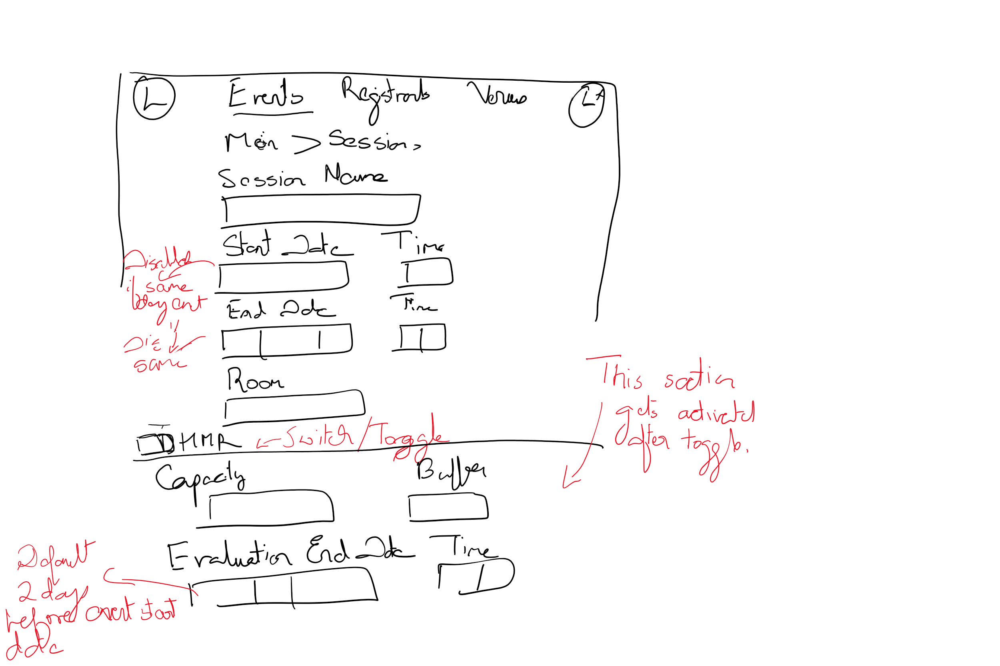

> If you're learning how to code and (are) feeling burnt out, I highly suggest trying some design.
>It's like arts and crafts for web developers.
> \- [Tweet by Jack Forge](https://twitter.com/TheJackForge/status/1433782797299175428?ref_src=twsrc%5Etfw) September 3, 2021

Are you beginning to learn Web Development and are starting with either HTML, CSS, or JS, then please STOP!!! Obviously, you need to be well-versed about HTML elements, CSS properties, and JS functions, and you will, in due course. BUT, first read this seminal [css-tricks article](https://css-tricks.com/a-step-by-step-process-for-turning-designs-into-code/). Mark's article should be the preamble of all web development courses; alas, it's not.

## Wireframing

I used Adrian Twarog's [freeCodecamp article](https://www.freecodecamp.org/news/ui-ux-design-tutorial-from-zero-to-hero-with-wireframe-prototype-figma/) as a starting point which kicks off the design process by creating a sitemap: a preliminary inventory of all the pages that will comprise your site. If you recollect, we already have this, courtesy of [Event Modelling](./Event_Modeling_Feature_Mapping).

First up, I drew the skeletal sketches in a book. I cycled through a lot of combinations [and reams of pages] before I settled on one; essentially, I was riffing on the structure and elements of the website.

### Digital Whiteboard

I installed [Concepts](https://concepts.app/)[while it was a Mac-only app, they have recently debuted on Windows Store too]. But it was not free. Also a shame that even though Concept has apps for most platforms, we cannot share sketches across devices[mobile or desktop]. Next, I experimented with Figma's [FigJam](https://www.figma.com/figjam/). Lotsa fun, but for a collaborative whiteboard/freeform drawing, it has a glaring lacuna: it's missing the all-important erase tool. In the end, [Microsoft Whiteboard](https://www.microsoft.com/en-in/microsoft-365/microsoft-whiteboard/digital-whiteboard-app) got the job done without getting in the way.

## UI Layout

A key takeaway from Adrian's video is using the layout grid as a visual rail to finesse the alignment of elements/objects.

One of Microsoft Whiteboard's noteworthy features is that we can export our sketches as an SVG. This allows us to conveniently drag and place our drawings adjacent to our frames in Figma and easily compare our progress[see left in the above pic; another Adrian tip].

I was raring to take my Figma game to the next level, and [Brian Wood's Linkedin course](https://www.linkedin.com/learning/figma-essential-training-the-basics/the-basics-of-figma) does just that. It sparks the joy in using Figma: making icons, tips & tricks, etc. But the crucial learning was showing how we can leverage Figma's vast community to turbocharge our productivity. There is a world of UI Kits, plugins, illustrations, etc., out there that you can use "as-is" in your design. In a way, Figma is like the **VS Code of Design**  and I loved 💗💗💗 it.

Check out my labor of love, the final [Figma frames](https://www.figma.com/file/Rh8gLjoKE9j12JNlG0g2qB/Organizer-Home?node-id=0%3A1)

In the above pic, I have highlighted one of the community UI kits, from which I have sourced some of the elements I have used in the above frames.

## Prototyping

Finally, I created the site's prototype in Figma, showcasing the navigation of the different pages of our web app. You can take it for a twirl on the [Figma App](https://www.figma.com/file/Rh8gLjoKE9j12JNlG0g2qB/Organizer-Home?node-id=2%3A4)[Click on the play button to see the animation].

If you are a regular user of Figma, something should have caught your eye in the gif above. The sync button turns blue when clicking the mouse on it: its a beta feature, [Interactive Components](https://forum.figma.com/c/interactive-components-beta/37) building upon [Figma variants](https://www.figma.com/best-practices/creating-and-organizing-variants/)

I'm pumped: in our next iteration circa October-start, I'll be adopting a more elaborate workflow incorporating the different Figma plugins. Stay tuned for that post.

## Conclusion

Most backend developers, no matter how many SPA tutorials they complete, stumble initially. These tutorials start with an arbitrary component without addressing how and why a particular visual element is a component. Guess what, my friend, the epiphany for me was when I discovered those are identified much before coding, in the design phase. Check out the below picture: visual elements are grouped, classified as an individual component, or could be nested in another, all within a visual hierarchy.

 I'm going to end this blog post the same way I began it by imploring developers to ensure that you are well versed with the structural ideas of your site, along with the layout, before you commence coding. Because if the foundation is not set right and the wooden beams/steel trusses are not perfectly aligned, your house aka app is going to be wobbly, no matter what. React/Vue/Blazor components, in the words of Pink Floyd, are just ["another brick in the wall"](https://www.youtube.com/watch?v=YR5ApYxkU-U).
