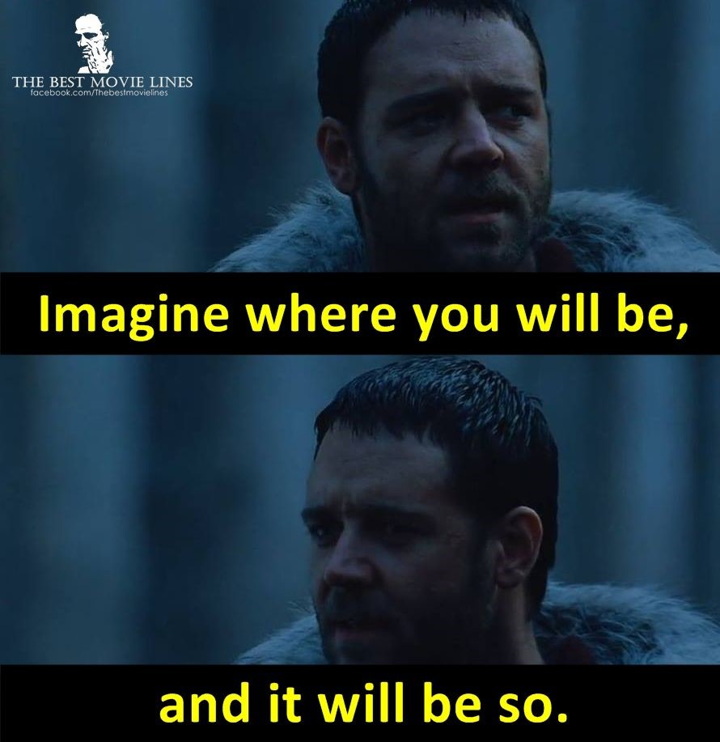
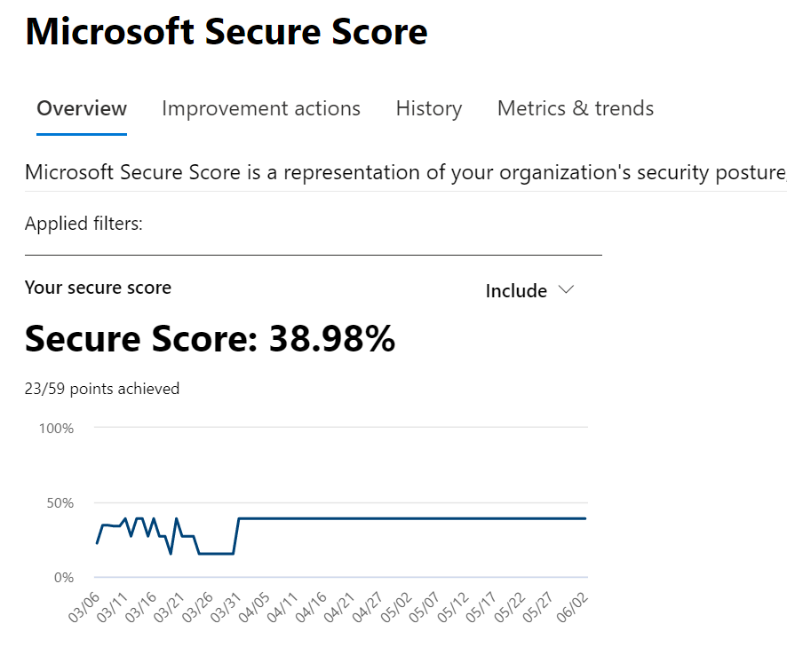
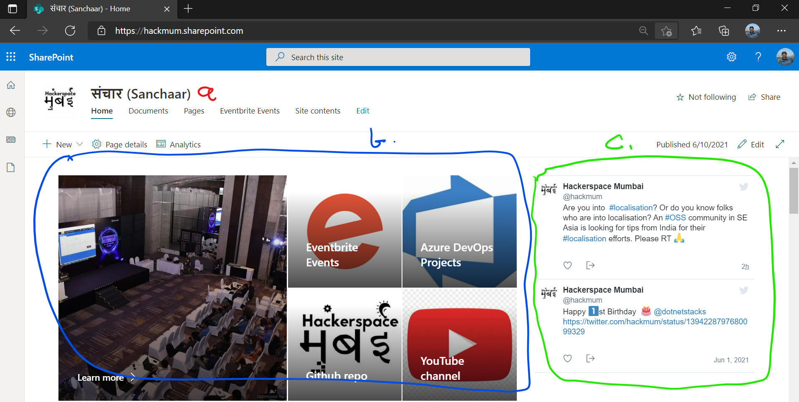
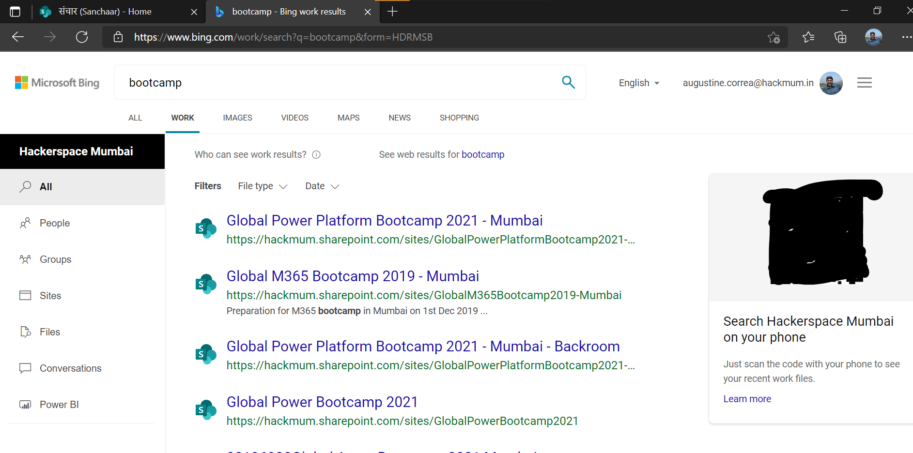
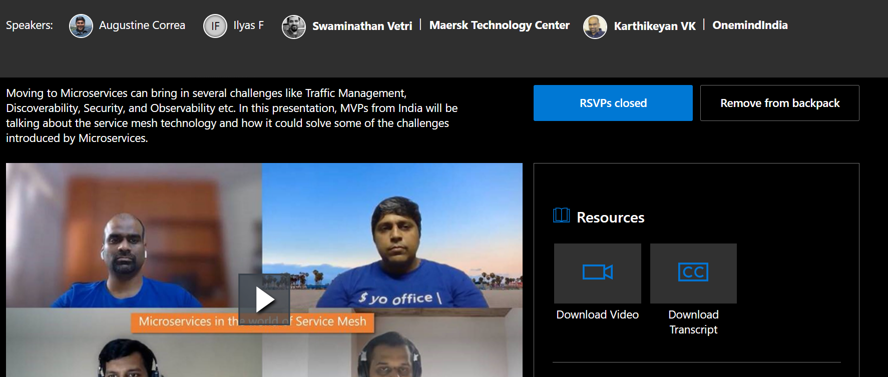
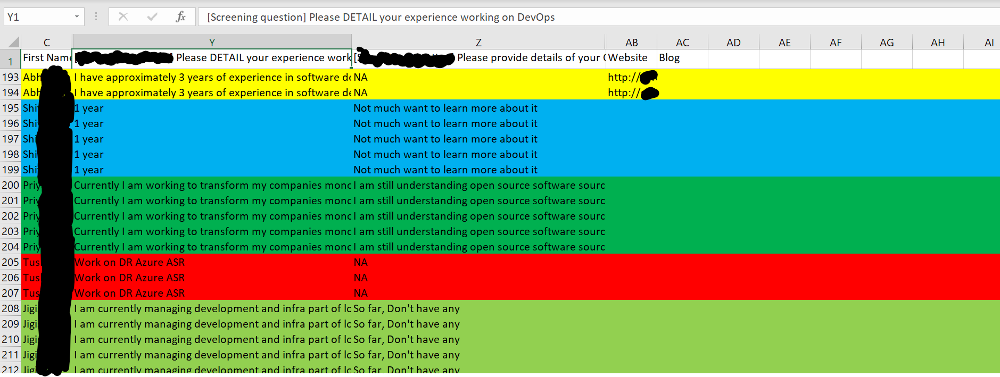
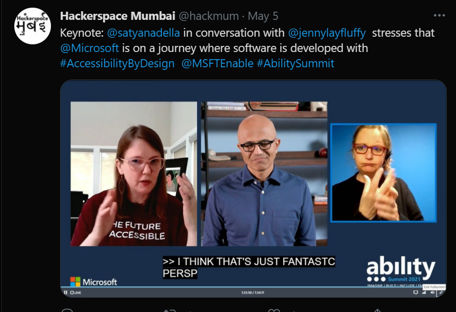

Being the largest OSS community in Bombay, we are hosting its longest-running tech meetup [over 8 years] #mumtechup. #COVID19 has brought an abrupt halt to all in-person events.

Whenever confronted by uncertainty, the below quote from Gladiator would help to show the path ahead:

And we are preparing for the day when we can all meet in person.

During the lockdown, we had ample opportunities to examine how we have been organizing events and what to expect in the future.

\#TheMVPChallenge consisted of three learning paths: Microsoft 365, Dynamics365 & Power Platform, and AI & Data. And I completed all three because each of them had a crucial bearing on what we are planning to do.

## \#TheMVPChallenge - Microsoft 365 Learning Path

As an MVP, one of the benefits I enjoy is an M365 subscription which I have been exclusively using for our community activities for the last three years: Email invitation for upcoming events, informing registrants of their status, reminders for event guests and speakers, etc.

I just did the bare minimum configuration, got it working for our basic needs, and that was it.

So while I use the subscription for community activities, I still wanted to apply enterprise-level standards for our processes. So this lockdown, I decided to take a peek under the hood. And a good thing I took this learning path.

### Microsoft Secure Score

The biggest eye-opener was when I came across the Microsoft Secure Score module [Organizational productivity - Learn | Microsoft Docs](https://docs.microsoft.com/en-us/learn/modules/manage-your-business-with-microsoft-365/2-organizational-productivity). Never heard of it before, but it had enough gravitas for me to check it out. And our score was abysmal. We owed it to ourselves and our community members to do much better, and I'm glad to report that I have corrected this.

### Sharepoint

Over the years, we have accumulated quite a lot of data. We needed to ensure the data was not only stored securely but was shared internally with the right persons like event coordinators, venue liaison personnel, etc.

For us, Sharepoint fits that bill perfectly.  
[File storage and sharing with OneDrive and SharePoint - Learn | Microsoft Docs](https://docs.microsoft.com/en-us/learn/modules/file-storage-sharing-with-onedrive-sharepoint/?WT.mc_id=M365-MVP-5003041)

  a. The title for our communication site is in Marathi, which translates to communication [a nod to localization]
  b. Our hero web part :
    i. The large photo on the left is that of our largest meetup held at a 5-star hotel; it serves as a constant aspiration for core team members to surpass.
    ii. The others are to provide easy access to links for our public-facing properties.
  c. Our Twitter timeline

Bonus: You can search for your content right from Microsoft Edge

### M365 Compliance Manager

Across eight years and over 150 events and communicating with more than 5000 unique contacts, we have accumulated a lot of privileged information that folks have entrusted with us.

With M365, we get Compliance Manager, which provides an out-of-the-box enterprise-grade tool to ensure we are safeguarding privacy as per regulations enforced in the world.

[Describe the compliance management capabilities in Microsoft - Learn | Microsoft Docs](https://docs.microsoft.com/en-us/learn/modules/describe-compliance-management-capabilities-microsoft/?WT.mc_id=M365-MVP-5003041)

### Microsoft Teams

During this pandemic, all our events have been online. And for us, Microsoft Teams has been our workhorse that has helped folks stay connected, collaborate, and hold virtual meetups.

MS Teams related modules form the backbone of my learning path collection

## Dynamics 365 and Power Platform

Initially, venues will open up with physical distancing norms in effect. And crucially only for folks who are fully vaccinated [ie. 28 days post 2nd dose].

As organizers of regularly houseful events, we need to drastically reduce no-shows and also verify the vaccination status of the guests. And till then, keep the show running virtually.

### Power Apps & Power Automate

Our app Visage[hosted on Azure] helps community organizers to triage event registrations and subsequently manage check-ins to those events. We are overhauling the app to cater-
  a. The pandemic-induced normal
  b. Incorporate new technologies [.net 6]. We are aiming to be in time for .net Conf [Nov'21].

But before releasing publicly for other community organizers to use, we need to experiment & validate different scenarios & combinations in our processes, and because of the rapid iterations afforded to us by the Power Platform, we can cycle through scenarios quickly. My blog post [Powering Up Your MVP](/poweringup_your_mvp) throws light on how we went about it.

> "Power Platform in the sheets, Azure in the streets."

This approach can help firms unlock values that are innovated within their enterprise by "SaaSifying" them.

### Power Virtual Agents

The #TheMVPChallenge learning path also nudged us to look at developing "Power Virtual Agents" to cater for the many questions [that are mostly repeated 😊] we get from volunteers at different venues across our events.

### Power BI

We will use Power BI to display metrics that are important for us but are missing from most event management tools like percentage of no-shows, acknowledgments lapses, et  c. The plan is to have BI metrics shown prominently in our Sharepoint communication site mentioned above.  

## Azure AI & Data Learning Path

### Classification Modelling

One of the time-consuming aspects for me is the evaluation of event registration. Usually, a registrant's answers to our registration questions will indicate the likelihood of a candidate attending. An even more worrying trend in the last few years has been bot-generated bogus registrations.

Going through the AI & Data learning path of the Challenge, it struck me that the below Classification module would help in identifying such registrations

[Create a classification model with Azure Machine Learning designer - Learn | Microsoft Docs](https://docs.microsoft.com/en-us/learn/modules/create-classification-model-azure-machine-learning-designer/?WT.mc_id=AI-MVP-5003041)

### Regression Modelling

Also, we need to know if a registrant will attend or not. And when I undertook the below regression module, I had an Aha moment. Since we have been diligently following the process right from registration right up to check-ins for the past eight years, we have enough data to undertake regression modeling.

[Create a classification model with Azure Machine Learning designer - Learn | Microsoft Docs](https://docs.microsoft.com/en-us/learn/modules/create-regression-model-azure-machine-learning-designer/?WT.mc_id=AI-MVP-5003041)

Next, we get a lot of queries from registrants throughout the process, before event registration opens up and even after the event ends. Most of these questions are of the same nature, and that's where the Azure Bot Service in the learning path will help to answer most of their queries.

[Build a bot with QnA Maker and Azure Bot Service - Learn | Microsoft Docs](https://docs.microsoft.com/en-us/learn/modules/build-faq-chatbot-qna-maker-azure-bot-service/?WT.mc_id=AI-MVP-5003041)

In a contactless world, we need to ensure that our check-in process also keeps pace with it. Our check-in process will now involve self-check-ins using Face Recognition.

[Detect and analyze faces with the Face service - Learn | Microsoft Docs](https://docs.microsoft.com/en-us/learn/modules/detect-analyze-faces/?WT.mc_id=AI-MVP-5003041)

Some stretch features that this learning path has got us thinking:

  1. Ensure physical distancing norms are maintained in the event hall using Azure Cognitive Services [The plan is to experiment with Microsoft AI Vision kit A Smart Camera for the Intelligent Edge - Vision AI DevKit (azure.github.io)]
  2. Analyse an  audience's expression during a session which is valuable feedback to a speaker  
  Identify faces and expressions by using the Computer Vision API in Azure Cognitive Services - Learn | Microsoft Docs

  

## Diversity and Inclusion

All three learning paths had a set of modules for Diversity and Inclusion. It brought home a long-ignored fact: Accessibility immeasurably improves an attendee's experience. We will ensure to put these learnings into effect when we refactor the Visage app.

[App development - Learn | Microsoft Docs](https://docs.microsoft.com/en-us/learn/modules/digital-accessibility/01-app-development/?WT.mc_id=AI-MVP-5003041)

I was eager to undertake the Accessibility and Diversity module after attending the [Ability Summit](https://sway.office.com/Dbr2Uz14PIn31Dq8?ref=Link). And was inspired by that summit to have a mantra for everything I do: "Accessibility by Design."

If you are a community organizer who has an M365 and an Azure subscription, then [my Microsoft Learning collection](https://docs.microsoft.com/en-us/users/augustinecorrea-4621/collections/7dr4u7g4e462j4) would be a great way for you to ease into these technologies.

> We are putting our goals publicly so that you can hold us accountable when we next meet.
> Stay safe. See you soon.
